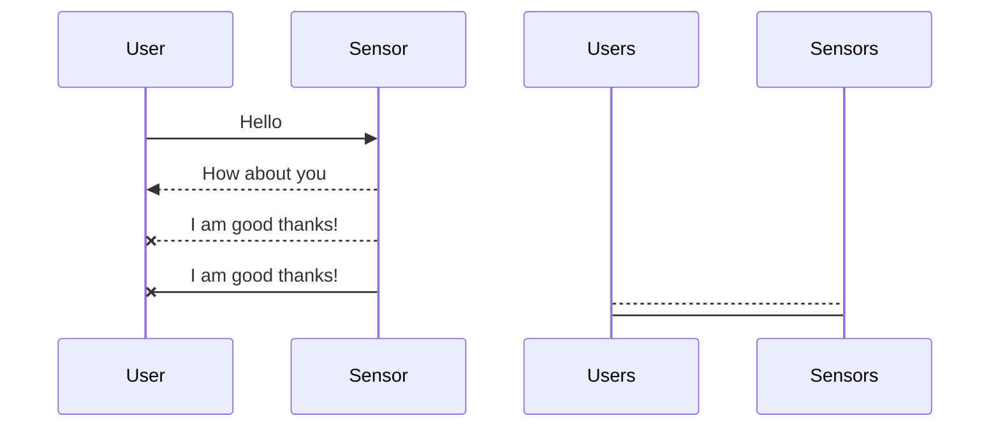
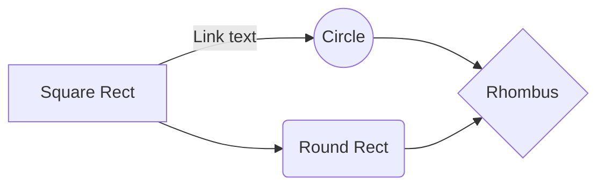

# Welcome to Our PI_esprit Project

This is an innovative project for esprit university made for academic purposes.
It aims to create a smart city monitoring Web application where users could check the gas rates of their cities provided by the sensors plugged there already.
Hope you like it feel free to support with any Merge Requests with details.

# Files
Angular Front end side must be created by Node modules npm install then check it in the dev mode by using the command ng serve.
Node_backend the backend side can be installed the same way just npm install then node run dev to keep it alive and ready for any patch.

## Project by
Mohamed Nidhal Sadfi
Khalil Hechmi
Ahmed Ibrahim Fattoumi
Youssef Meganem
Aziz Ouerfeli
Iheb ben marzouk
## UML diagrams
More about that later when everything becomes more clear

And this will produce a flow chart:

